## TASK 1:

- Count the total number of customers who joined in 2023.

`
SELECT
	COUNT(*) AS num_of_customers
FROM
	customers
WHERE
	DATE_PART('year', join_date) = 2023;
`

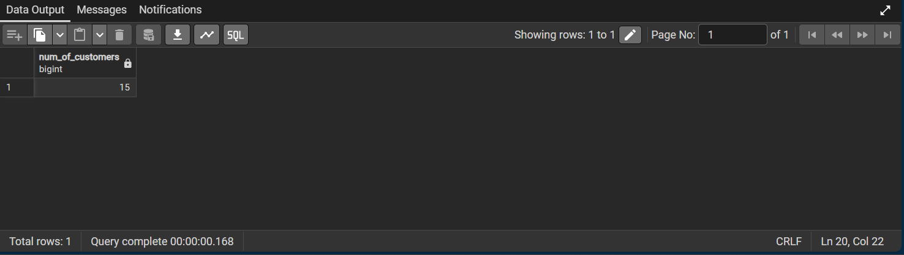

## Task 2:

- For each customer return customer_id, full_name, total_revenue (sum of total_amount from orders). Sort descending.

`  
SELECT
	c.customer_id,
	c.full_name,
	SUM(o.total_amount) AS total_revenue
FROM
	customers AS c
LEFT JOIN
	orders AS o 
		ON c.customer_id = o.customer_id
GROUP BY
	c.customer_id,
	c.full_name
ORDER BY
	total_revenue DESC;
`

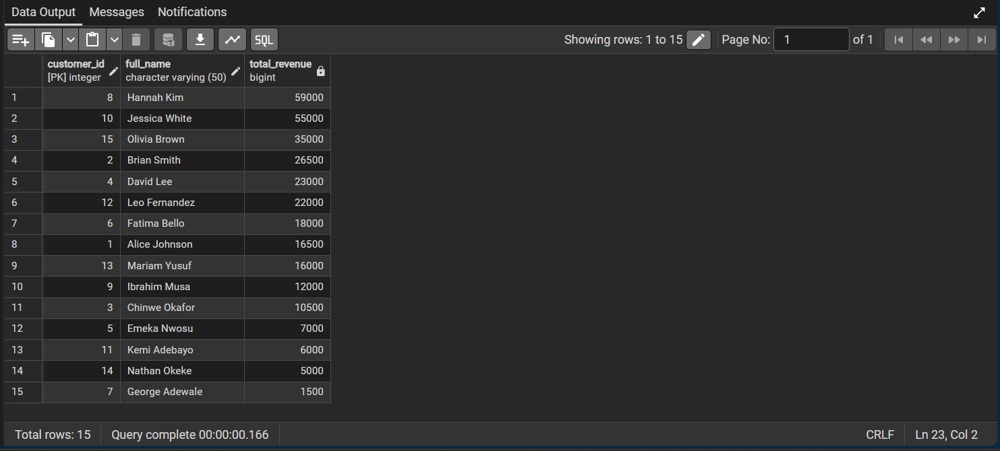

## Task 3:

- Return the top 5 customers by total_revenue with their rank.

`
SELECT
	o.customer_id,
	c.full_name,
	SUM(o.total_amount) AS total_revenue,
	RANK() OVER (ORDER BY SUM(o.total_amount) DESC) AS customer_rank
FROM
	orders AS o
INNER JOIN
	customers AS c
		ON c.customer_id = o.customer_id
GROUP BY
	o.customer_id,
	c.full_name
LIMIT 5;
`

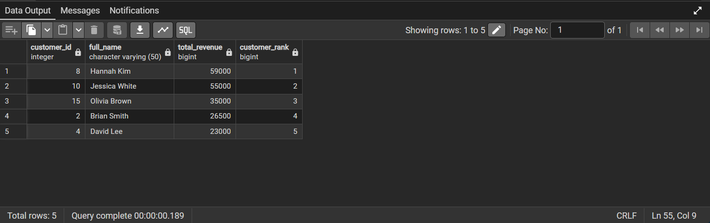

## Task 4:

- Produce a table with year, month, monthly_revenue for all months in 2023 ordered chronologically.

`
SELECT
	DATE_PART('year', order_date) AS year,
	DATE_PART('month', order_date) AS month,
	SUM(total_amount) AS monthly_revenue
FROM
	orders
WHERE
	DATE_PART('year', order_date) = 2023
GROUP BY
	year,
	month
ORDER BY
	year,
	month;
`

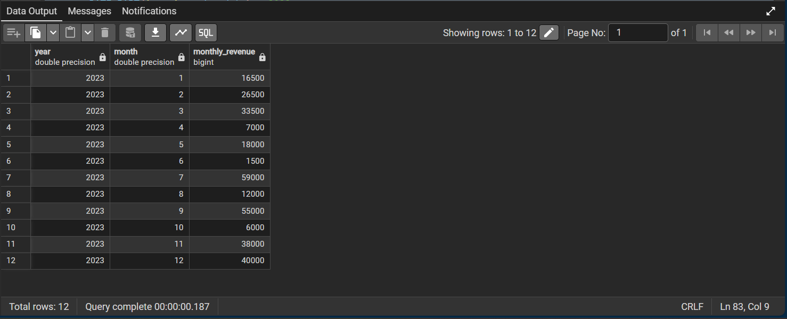

## Task 5:

- Find customers with no orders in the last 60 days relative to 2023-12-31 (i.e., consider last active date up to 2023-12-31). Return customer_id, full_name, last_order_date.

`
SELECT
	o.customer_id,
	c.full_name,
	MAX(o.order_date) AS last_order_date
FROM
	orders AS o
LEFT JOIN
	customers AS c
		ON o.customer_id = c.customer_id
GROUP BY
	o.order_id,
	c.full_name
HAVING
	MAX(o.order_date) < '2023-12-31'::date - INTERVAL '60 days';
`

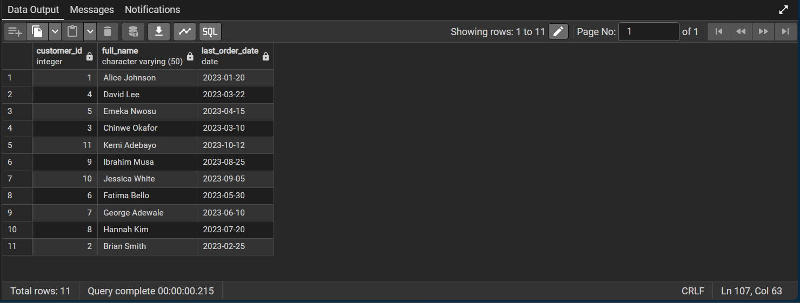

## Task 6:

- Calculate average order value (AOV) for each customer: return customer_id, full_name, aov (average total_amount of their orders). Exclude customers with no orders

`
SELECT
	c.customer_id,
	c.full_name,
	ROUND(AVG(o.total_amount)) AS aov
FROM
	customers AS c
INNER JOIN
	orders AS o	-- INNER JOIN to exclude customers with no orders
		ON c.customer_id = o.customer_id
GROUP BY
	1, 2
ORDER BY
	aov DESC;
`

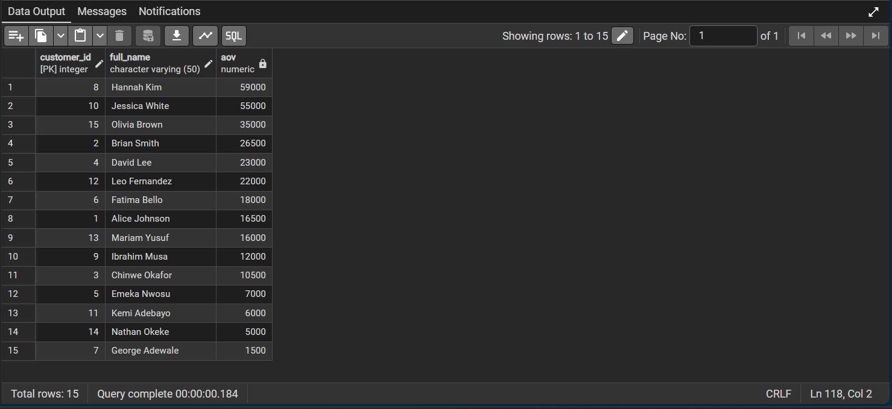

## Task 7:

- For all customers who have at least one order, compute customer_id, full_name, total_revenue, spend_rank where spend_rank is a dense rank, highest spender = rank 1.

`
SELECT
	c.customer_id,
	c.full_name,
	SUM(o.total_amount) AS total_revenue,
	DENSE_RANK() OVER (ORDER BY SUM(o.total_amount) DESC) AS spend_rank
FROM
	customers AS c
INNER JOIN
	orders AS o 
		ON c.customer_id = o.customer_id 
GROUP BY
	c.customer_id, 
	c.full_name
ORDER BY
	total_revenue DESC,
	spend_rank;
`

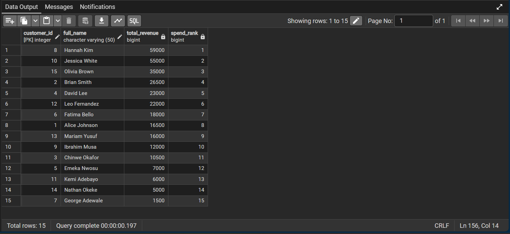

## Task 8:

- List customers who placed more than 1 order and show customer_id, full_name, order_count, first_order_date, last_order_date.

`
SELECT
	c.customer_id,
	c.full_name,
	COUNT(o.order_id) AS order_account,
	MIN(o.order_date) as first_order_date,
	MAX(o.order_date) AS last_order_date
FROM
	customers AS c
INNER JOIN
	orders AS o
		ON c.customer_id = o.customer_id
GROUP BY
	c.customer_id,
	c.full_name
HAVING
	COUNT(o.order_id) > 1
ORDER BY
	order_count DESC;
`

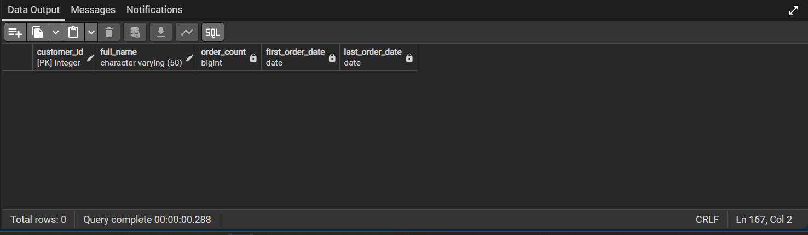

## Task 9: 

- Compute total loyalty points per customer. Include customers with 0 points.

`
SELECT
	c.customer_id,
	c.full_name,
	SUM(lp.points_earned) AS total_points
FROM
	customers AS c
LEFT JOIN
	loyalty_points AS lp
		ON c.customer_id = lp.customer_id
GROUP BY
	c.customer_id,
	c.full_name
ORDER BY
	total_points DESC;
`

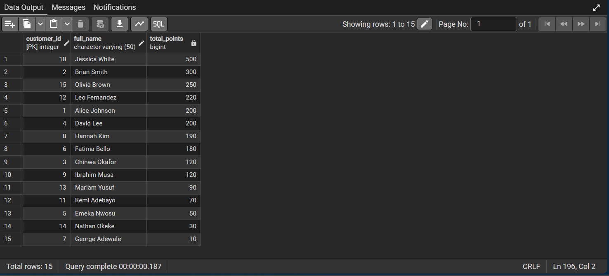

## Task 10:

- Assign loyalty tiers based on total points:
    - Bronze: < 100
    - Silver: 100–499
    - Gold: >= 500
    Output: tier, tier_count, tier_total_points

`
WITH CTE_loyalty_tiers AS
(	
	SELECT
		customer_id,
		SUM(points_earned) AS total_points,
		CASE
			WHEN SUM(points_earned) < 100 THEN 'Bronze'
			WHEN SUM(points_earned) BETWEEN 100 AND 499 THEN 'Silver'
			ELSE 'Gold' 
		END AS tier
	FROM
		loyalty_points
	GROUP BY
		customer_id
)
SELECT 
	tier,
	COUNT(customer_id) AS tier_count,
	SUM(total_points) AS tier_total_points
FROM
	CTE_loyalty_tiers
GROUP BY
	tier
ORDER BY
	CASE 
		WHEN tier = 'Gold' THEN 1
		WHEN tier = 'Silver' THEN 2
		ELSE 3
	END;
`

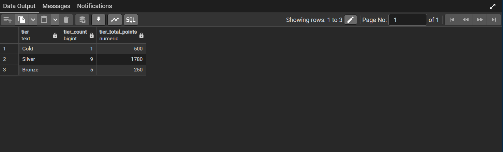

## Task 11:

- Identify customers who spent more than ₦50,000 in total but have less than 200 loyalty points. Return customer_id, full_name, total_spend, total_points.

`
WITH CTE_customer_record AS
(	-- Total Spend & Total Points
	SELECT
		o.customer_id,
		c.full_name,
		SUM(o.total_amount) AS total_spend,
       	SUM(lp.points_earned) AS total_points
	FROM
		orders AS o
	LEFT JOIN
		loyalty_points AS lp
			ON lp.customer_id = o.customer_id
	LEFT JOIN
		customers AS c
			ON c.customer_id = o.customer_id
	GROUP BY
		o.customer_id,
		c.full_name
)
-- Filter the table based on set value (condition) for total spend & total points
SELECT *
FROM
	CTE_customer_record
WHERE
	total_spend > '50000' AND
	total_points  < '200';
`

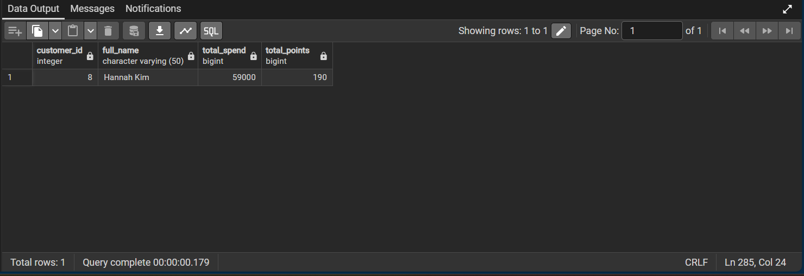

## Task 12:

- Flag customers as churn_risk if they have no orders in the last 90 days (relative to 2023-12-31) AND are in the Bronze tier. Return customer_id, full_name, last_order_date, total_points.

`
WITH CTE_customer_records AS
(	-- Total points and last_order_date for all customers
	SELECT
		c.customer_id,
		c.full_name,
		MAX(o.order_date) AS last_order_date,
	SUM(lp.points_earned) AS total_points,
		CASE
			WHEN SUM(lp.points_earned) < 100 THEN 'Bronze'
			WHEN SUM(lp.points_earned) BETWEEN 100 AND 499 THEN 'Silver'
			ELSE 'Gold' 
		END AS tier
	FROM
		customers AS c
	LEFT JOIN
		loyalty_points AS lp
			ON lp.customer_id = c.customer_id
	LEFT JOIN
		orders AS o
			ON o.customer_id = c.customer_id
	GROUP BY
		c.customer_id,
		c.full_name
)
-- Filter for churn_risk based on 90-days inactivity (from 2023-12-31), and category of points earned
SELECT
	*
FROM
	CTE_customer_records
WHERE
	last_order_date < '2023-12-31'::date - INTERVAL '90 days'
	AND tier = 'Bronze';
`

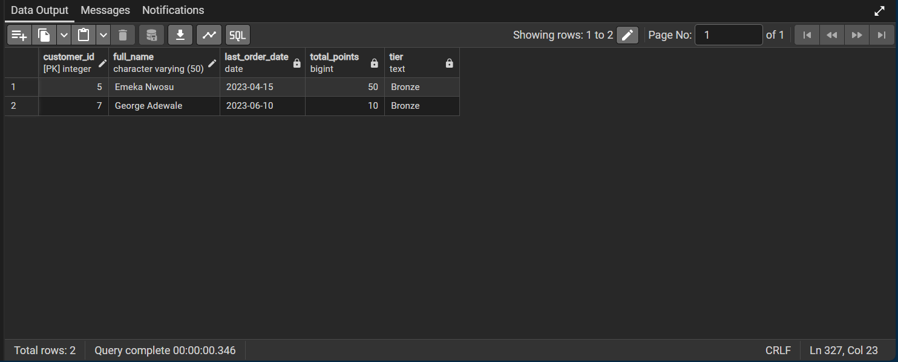