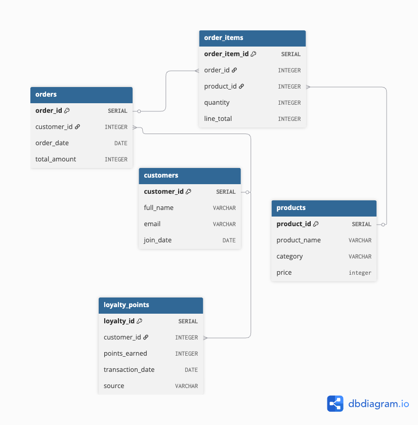

# LaunchMart Customer Loyalty Analysis

This project provides a detailed analysis of customer behavior, revenue performance, and loyalty program engagement for LaunchMart, a growing African e-commerce company. The goal was to generate actionable insights to support the marketing and operations teams in driving customer retention and optimizing the loyalty program.

## 🎯 Key Objectives
The analysis focused on answering critical business questions across three main areas:

1. ***Revenue and Order Performance***: Tracking monthly sales, Average Order Value (AOV), and identifying top spenders.

2. ***Customer Activity & Retention***: Identifying inactive customers and those at risk of churn.

3. ***Loyalty Program Assessment***: Segmenting customers into loyalty tiers (Bronze, Silver, Gold) based on total points.

## 📊 Data Schema
The analysis uses five core tables:

`customers`: Customer demographic data.

`products`: Product details and pricing.

`orders`: Transaction records (with total_amount).

`order_items`: Line-item details linking products to orders.

`loyalty_points`: Records of points earned by customers.

